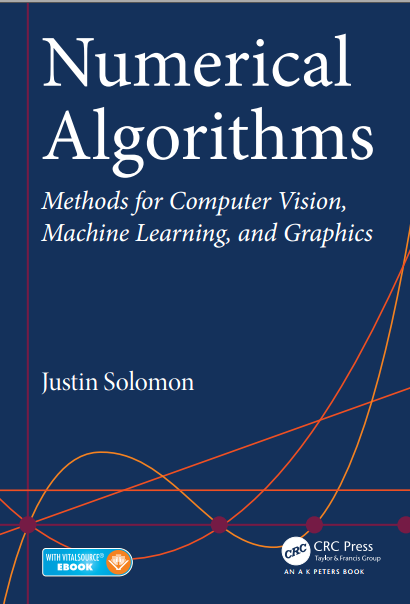

# Numerical Algorithms Methods for Computer Vision, Machine Learning, and Graphics
Implement the main algorithms from scratch with python in the book-"Numerical Algorithms Methods" by Justin Solomon. The author also open a course called "cs205a" in the Standford University. You can assess this course from [here](https://www.youtube.com/watch?v=dkT8yuI2d50&list=PLQ3UicqQtfNvQ_VzflHYKhAqZiTxOkSwi)

## [About the book](https://www.amazon.com/Numerical-Algorithms-Computer-Learning-Paperback/dp/B014I7TJ66/ref=sr_1_fkmrnull_3?__mk_zh_CN=%E4%BA%9A%E9%A9%AC%E9%80%8A%E7%BD%91%E7%AB%99&keywords=Numerical+Algorithms+Methods+for+Computer+Vision%2C+Machine+Learning%2C+and+Graphics&qid=1556957405&s=gateway&sr=8-3-fkmrnull)

## [Contents](https://github.com/TaiChiTiger/numerical-algorithms/tree/master/book_contents)  

 - __Part I: Preliminaries__
   - [Chapter 1: Mathematics Review](https://github.com/TaiChiTiger/numerical-algorithms/tree/master/book_contents/1.mathematics-review)
   - [Chapter 2: Numerics and Error Analysis](https://github.com/TaiChiTiger/numerical-algorithms/tree/master/book_contents/2.numerics-and-error-analysis)
 - __Part II: Linear Algebra__
   - [Chapter 3: Linear Systems and the LU Decomposition](https://github.com/TaiChiTiger/numerical-algorithms/tree/master/book_contents/3.linear-systems-and-the-lu-decomposition)
   - [Chapter 4: Designing and Analyzing Linear Systems](https://github.com/TaiChiTiger/numerical-algorithms/tree/master/book_contents/4.designing-and-analyzing-linear-systems)
   - [Chapter 5: Column Spaces and QR](https://github.com/TaiChiTiger/numerical-algorithms/tree/master/book_contents/5.column-spaces-and-qr)
   - [Chapter 6: Eigenvectors](https://github.com/TaiChiTiger/numerical-algorithms/tree/master/book_contents/6.eigenvectors)
   - [Chapter 7: Singular Value Decomposition](https://github.com/TaiChiTiger/numerical-algorithms/tree/master/book_contents/7.singular-value-decomposition)
 - __Part III: Nonlinear Techniques__
   - [Chapter 8: Nonlinear Systems](https://github.com/TaiChiTiger/numerical-algorithms/tree/master/book_contents/8.nonlinear-systems)
   - [Chapter 9: Unconstrained Optimization](https://github.com/TaiChiTiger/numerical-algorithms/tree/master/book_contents/9.unconstrained-optimization)
   - [Chapter 10: Constrained Optimization](https://github.com/TaiChiTiger/numerical-algorithms/tree/master/notebooks/10.constrained-optimization)
   - [Chapter 11: Iterative Linear Solvers](https://github.com/TaiChiTiger/numerical-algorithms/tree/master/notebooks/11.iterative-linear-solvers)
   - [Chapter 12: Specialized Optimization Methods](https://github.com/TaiChiTiger/numerical-algorithms/tree/master/notebooks/12.specialized-optimization-methods)
 - __Part IV: Functions, Derivatives, and Integrals__
   - [Chapter 13: Interpolation](https://github.com/TaiChiTiger/numerical-algorithms/tree/master/notebooks/13.interpolation)
   - [Chapter 14: Integration and Differentiation](https://github.com/TaiChiTiger/numerical-algorithms/tree/master/notebooks/14.%20integration-and-differentiation)

## TODO

- [x ] write the main algorithms in the book
- [ ] add some important comments among codes
- [ ] add some bonuses about approximating distributions
